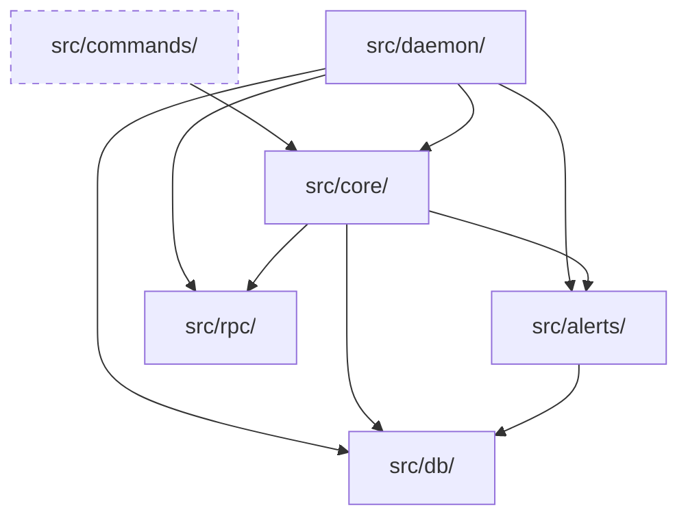

# Architecture

This document explains how sorokeep's pieces fit together at runtime. For *why* specific technologies were chosen (SQLite vs. Postgres, polling vs. event-driven, etc.), see [Architecture Decision Records](adr/). For the directory layout, see [CONTRIBUTING.md](../CONTRIBUTING.md#project-structure). This document is about *data flow* — what calls what, in what order, and why.

## The Daemon Cycle

The daemon (`sorokeep daemon`) is the long-running process most deployments actually run. Everything else — `watch`, `status`, `check` — exercises the same core functions as one-shot invocations.

```mermaid
sequenceDiagram
    participant loop as src/daemon/loop.ts
    participant monitor as src/core/monitor.ts
    participant extension as src/core/extension.ts
    participant dispatcher as src/alerts/dispatcher.ts
    participant db as src/db/repositories.ts

    Note over loop: setInterval tick triggers executeCycle()
    
    loop->>monitor: runMonitorCycle(db, network)
    activate monitor
    Note over monitor: 1. Batch-fetch TTLs via RPC<br/>2. Upsert fresh TTLs<br/>3. Detect threshold crossings & record AlertFired<br/>4. Resolve recovered alerts
    
    monitor->>extension: runAutoExtensions(db, network)
    activate extension
    Note over extension: Read extension_policies<br/>Simulate & submit ExtendFootprintTTLOp<br/>Record extension_history (cost, tx hash)
    extension-->>monitor: (extension results)
    deactivate extension
    
    monitor-->>loop: MonitorCycleResult
    deactivate monitor

    loop->>dispatcher: deliverPendingAlerts(db, network)
    activate dispatcher
    Note over dispatcher: Reads undelivered alerts from DB<br/>Routes to webhook/slack/etc.<br/>Increments retries on failure
    dispatcher-->>loop: (delivery results)
    deactivate dispatcher

    loop->>db: aggregateDailyCostSnapshots(db)
    activate db
    Note over db: Rolls extension_history into daily snapshots
    db-->>loop: (void)
    deactivate db
```

**Why threshold detection and delivery are separate steps.** `recordAlertFired` only writes a row — it never calls a webhook or Slack API directly from inside the monitor loop. This means a slow or failing alert channel can never block TTL detection or auto-extension, and a channel outage doesn't lose alerts — they sit in the queue and retry next cycle. The one exception is *resolution* notifications (`alert_resolved`), which fire immediately via `deliverSingleAlert` since they're not time-critical the way a new threshold crossing is, and there's no risk of losing an alert that was never "pending" in the first place.

**Why auto-extension runs after threshold detection, in the same phase.** Both read the same freshly-fetched TTL data from step 1a. Running extension immediately after avoids a second RPC round-trip to re-check TTLs that were just fetched.

## Fault Isolation

Three layers of error containment, from innermost to outermost:

1. **Per-contract** (`monitor.ts`) — one contract's RPC failure is caught and recorded in `result.errors`; the loop continues to the next contract. A single misbehaving contract can't stop the cycle.
2. **Per-phase** (`loop.ts` → `executeCycle`) — delivery and cost-snapshot aggregation are each wrapped in their own try/catch. A crash in `aggregateDailyCostSnapshots` can't prevent alert delivery, and vice versa.
3. **Per-cycle** (`loop.ts` → `scheduledTick`) — if `executeCycle` throws despite the above, the daemon logs it and waits for the next tick. The daemon itself never dies from a bad cycle.

**Re-entrance guard.** `cycleInFlight` (module-level in `loop.ts`) prevents a new tick from starting while the previous cycle is still running — for example, if an RPC call hangs longer than the poll interval. `stopDaemon()` deliberately does *not* reset this flag; it lets the in-flight cycle's own `finally` block clear it. Resetting it early would let a new `startDaemon()` call race with the still-running old cycle.

## Storage Model

Everything sorokeep knows lives in one SQLite file (`~/.sorokeep/sorokeep.db`, schema in `src/db/schema.sql`). No external services beyond the Stellar RPC endpoint itself. Key tables and how they relate to the cycle above:

- `contracts` / `contract_entries` — what's being watched, and each entry's last-known TTL
- `alert_configs` → `alerts_fired` — configured thresholds, and the delivery queue described above
- `extension_policies` → `extension_history` → `cost_daily_snapshots` — guard config, every extension transaction, and the daily rollups `sorokeep costs` reads
- `channel_accounts` — the pool of funded keypairs used to submit extension/restore transactions concurrently without sequence-number collisions (see `core/channels.ts`)
- `state_snapshots` / `state_changes` — used by the state-change detection path (diffing an entry's value across polls, independent of TTL)

## Module Dependencies

To enforce clean architecture, dependencies flow strictly inward. The `core` logic never depends on the CLI (`commands/`), allowing the daemon and one-shot commands to share the exact same implementations.



## Where a New Contribution Usually Lands

| Change | Files |
|---|---|
| New alert channel | `src/alerts/<channel>.ts` (implements `AlertChannel` from `alerts/types.ts`) plus a `registerAlertChannel(...)` call in `alerts/builtins.ts`. No dispatcher, CLI, or schema changes needed — see [docs/adding-an-alert-channel.md](adding-an-alert-channel.md) for the full walkthrough. |
| New CLI command | `src/commands/<name>.ts` (thin wrapper), core logic in `src/core/<name>.ts`, wired into `src/index.ts` |
| Change to threshold/extension logic | `src/core/monitor.ts` or `src/core/extension.ts` — read the fault-isolation notes above before touching these |
| New RPC-derived data | `src/rpc/client.ts` first, then whatever core module consumes it |

For production deployments, see [Observability Setup](observability.md) — Prometheus scraping, Grafana dashboards, and Alertmanager rules.

If a change doesn't fit cleanly into one of these rows, that's usually a sign to open an issue and discuss the approach before writing code — see [CONTRIBUTING.md](../CONTRIBUTING.md#larger-contributions).
